<div align="center">




<br/>

<a href="#"></a>
<a href="#"></a>
<a href="mailto:dummy@email.com"></a>

</div>
## About Me

```yaml
name: Raffa
role: Data Scientist | Web Enthusiast | Video Editor | Photographer
focus:
  - Building data-driven solutions with Python and ML
  - Crafting modern web experiences
  - Visual storytelling through video and photography
currently_exploring: ["Deep Learning", "Next.js", "Data Visualization"]
philosophy: "Data tells stories. Code brings them to life."
```
## Tech Stack

<div align="center">

<strong>Languages</strong>
<br/><br/>


<br/><br/>

<strong>Frameworks and Libraries</strong>
<br/><br/>

<br/><br/>


<br/><br/>

<strong>Database</strong>
<br/><br/>


<br/><br/>

<strong>Tools and Platforms</strong>
<br/><br/>

<br/><br/>


</div>
## Featured Projects

<table width="100%">
<tr>
<td width="50%" valign="top">

<h3>Project Alpha</h3>
<p>Deskripsi singkat project pertama. Ganti dengan project asli nanti.</p>
<p><strong>Stack:</strong> Python · Pandas · Streamlit</p>
<a href="#">View Repository</a>

</td>
<td width="50%" valign="top">

<h3>Project Beta</h3>
<p>Deskripsi singkat project kedua. Ganti dengan project asli nanti.</p>
<p><strong>Stack:</strong> Laravel · MySQL · Tailwind</p>
<a href="#">View Repository</a>

</td>
</tr>
</table>
## GitHub Analytics

<div align="center">


<br/><br/>


</div>

<br/>

## Achievements

<div align="center">

</div>

<br/>

## Contribution Snake

<div align="center">

</div>

<br/>

<div align="center">


<br/><br/>

<em>Open to collaboration on data science and web development projects.</em>

</div>

<br/>


